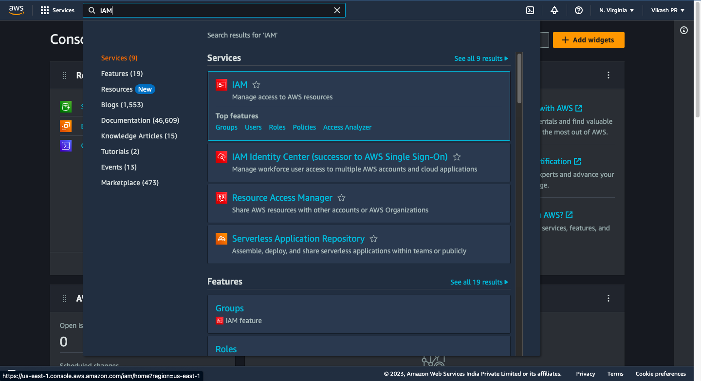
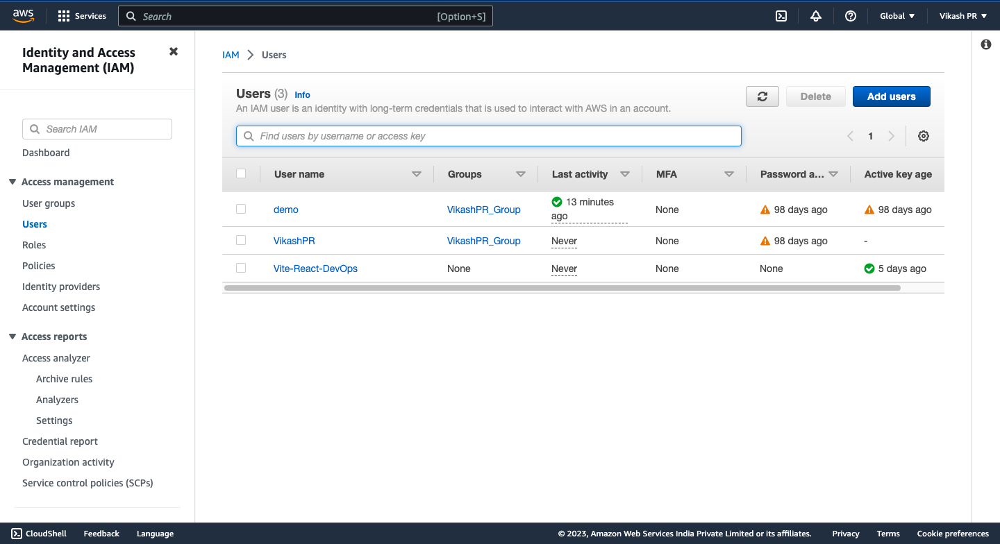
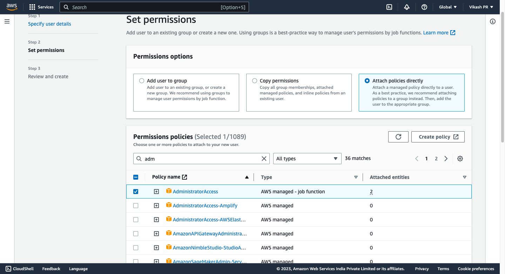
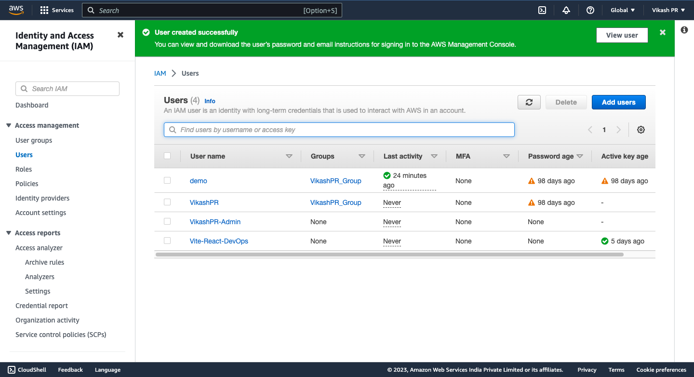
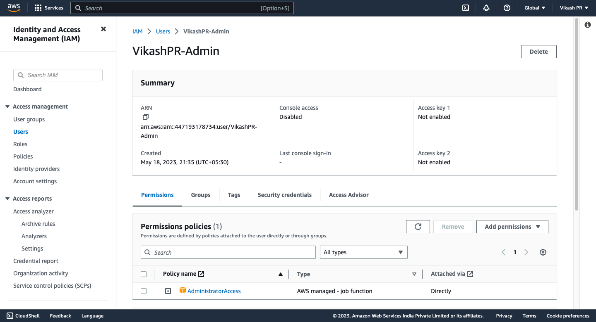

# Creating IAM user & IAM admin user in AWS

## Prerequisites

- AWS account

## Procedure for Creating IAM user and IAM admin user in AWS

- Login to AWS account Link: https://aws.amazon.com/
- Go to IAM service

- Click on Users

- Click on Add user
- Enter user name
- Select AWS access type
- Click on attach existing policies directly
- Select AdministratorAccess policy from the list of policies

- Click on Next: Tags
- Click on Next: Review
- Click on Create user

- The user is created successfully with admin access

