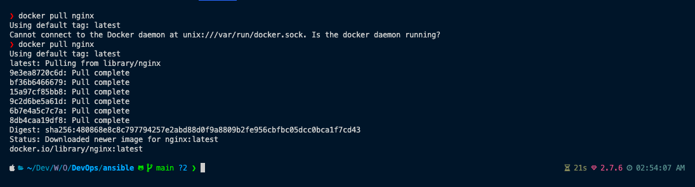
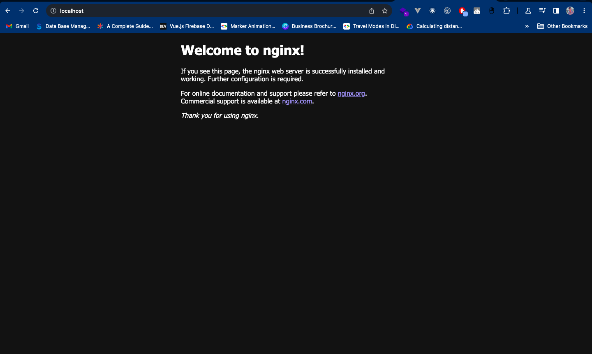

# Installation of Docker and working with simple docker image

## Step 1: Install Docker on mac OS

```sh
brew install docker
```

## Step 1: Install the docker via docker desktop [Link](https://docs.docker.com/desktop/install/mac-install/)

## Step 2: Verify the installation

```sh
docker --version
```

## Step 3: Pull the docker image

```sh
docker pull nginx
```


## Step 4: Run the docker image

```sh
docker run -d -p 80:80 nginx
```


## Step 5: Verify the docker image

```sh
docker ps
```

## Step 6: Stop the docker image

```sh
docker stop <container_id>
```

## Step 7: Remove the docker image

```sh
docker rm <container_id>
```

