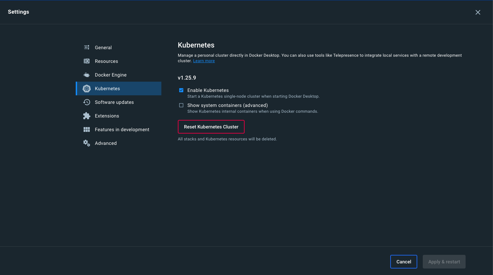
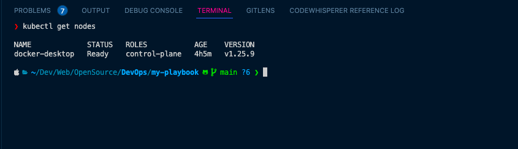
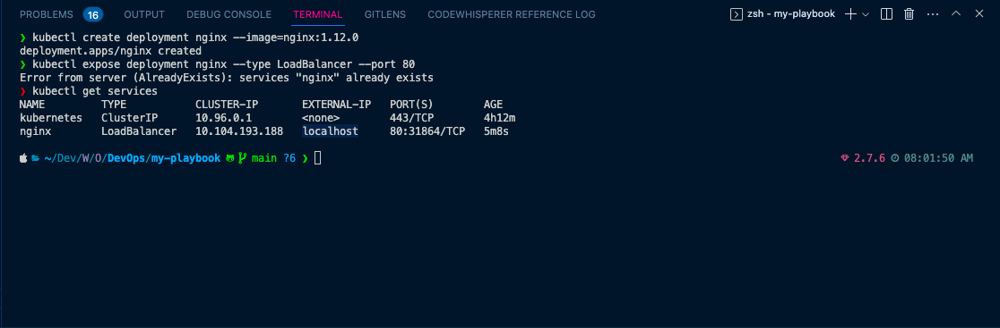
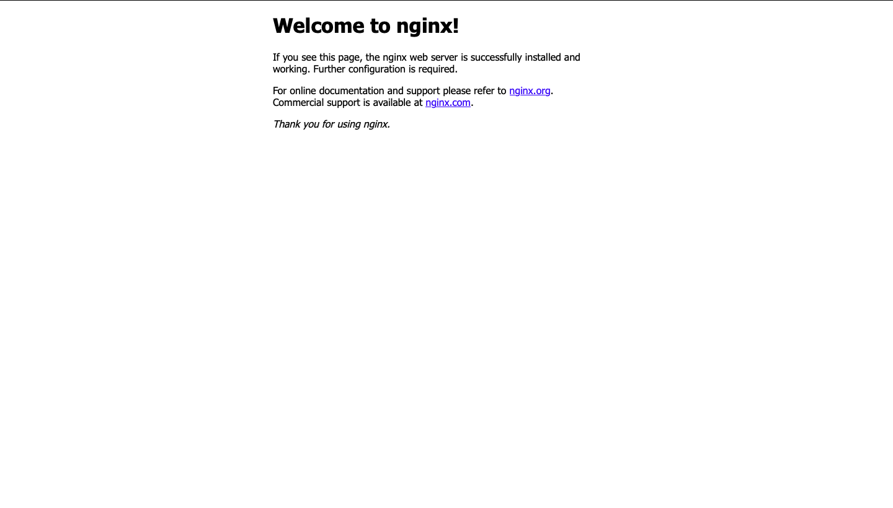

# Installation of Kubernetes and Deploying Kubeadm

## Prerequisites

- Docker
- Kubernetes


## Procedure

<!--  Download and install Docker Desktop for Windows from the Docker website
2. Once Docker Desktop is installed, open it and go to the Settings menu.
3. Click on the Kubernetes tab and enable Kubernetes.
4. Wait for Kubernetes to download and install. This may take several minutes. -->

1. Download and install Docker Desktop for Windows and MacOs from the Docker website
2. Once Docker Desktop is installed, open it and go to the Settings menu.
3. Click on the Kubernetes tab and enable Kubernetes.
4. Wait for Kubernetes to download and install. This may take several minutes.

5. Once Kubernetes is installed, open a command prompt and run the following command to verify that Kubernetes is running:
```bash
kubectl get nodes
```


6. Or you can run the following command to very that Kubernetes is installed:

```bash
kubectl version
```

7. To create a deployment, run the following command:

```bash
kubectl create deployment nginx --image=nginx
```

8. To view the deployment, run the following command:

```bash
kubectl get deployments
```

9. To view your deployment in a browser, run the following command:

```bash
kubectl expose deployment nginx --port=80 --type=LoadBalancer
```

10.To verify that the service is running, run the following command:

```bash
kubectl get services
```



11. Go to [localhost](http://localhost) to view the deployment.



12. To delete the deployment, run the following command:

```bash
kubectl delete deployment nginx
```

