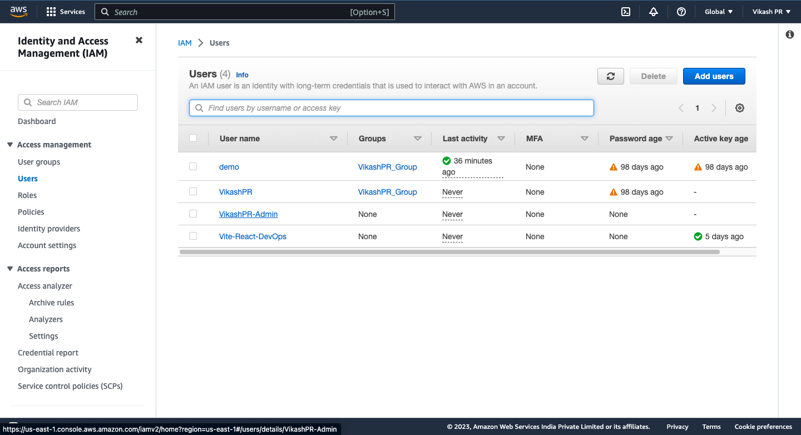
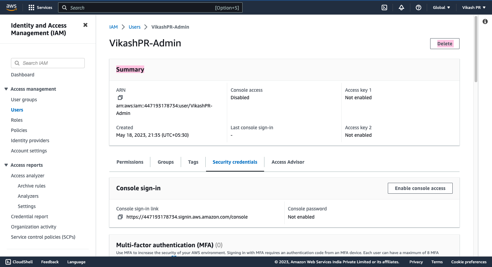
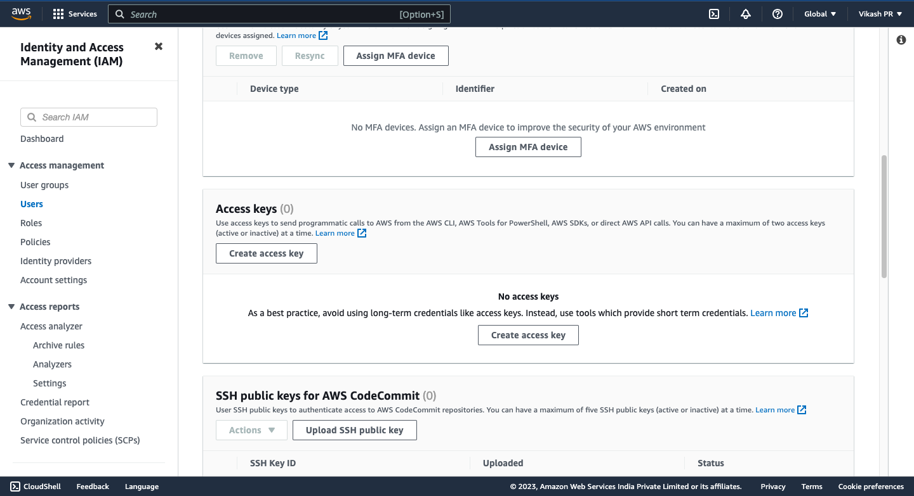
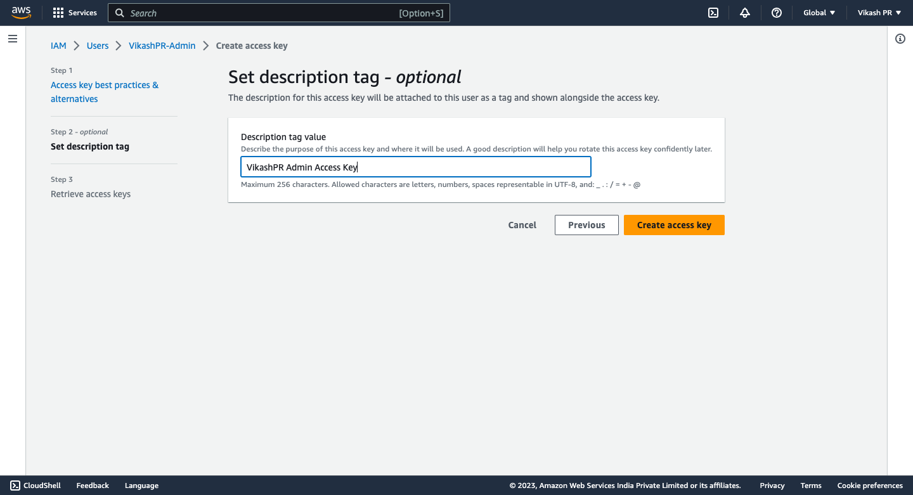
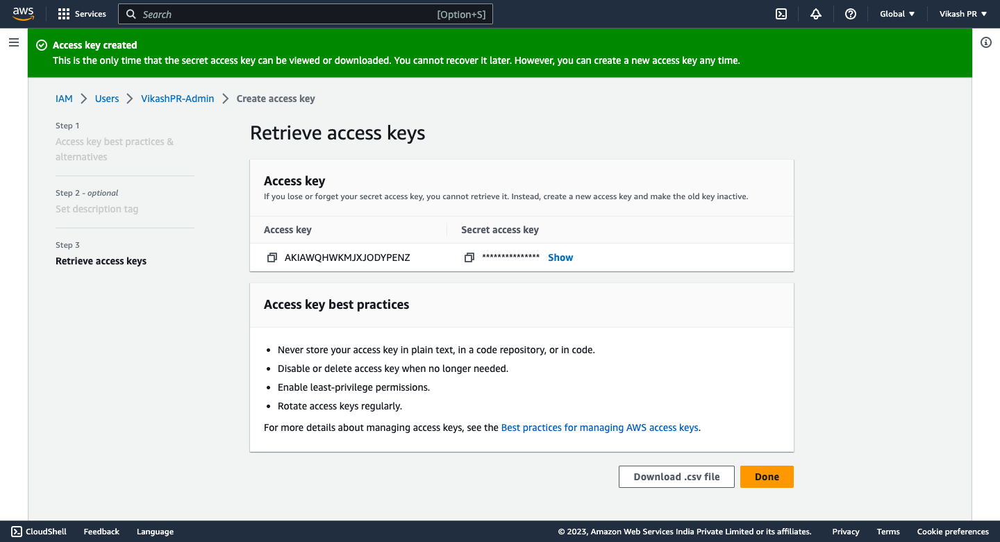
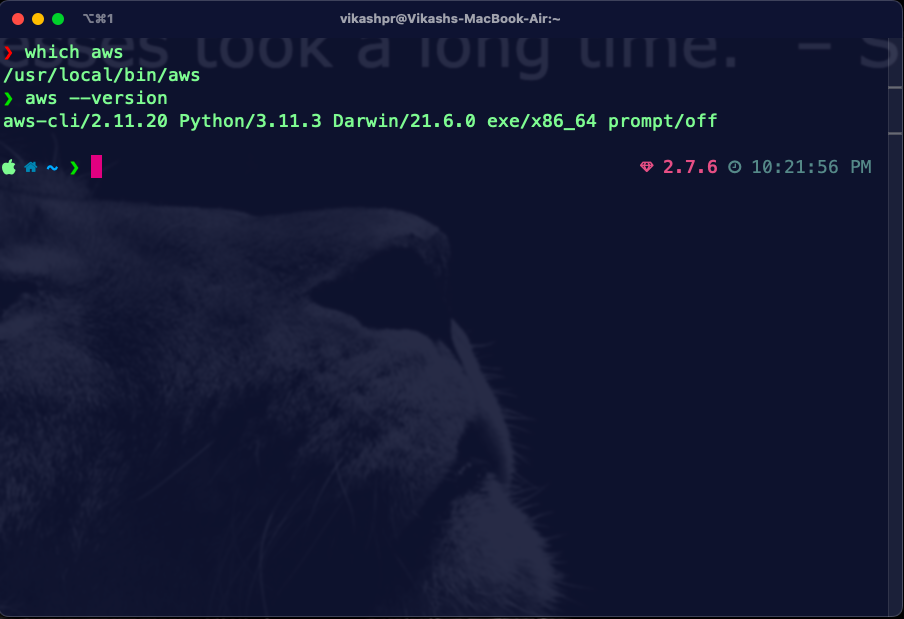
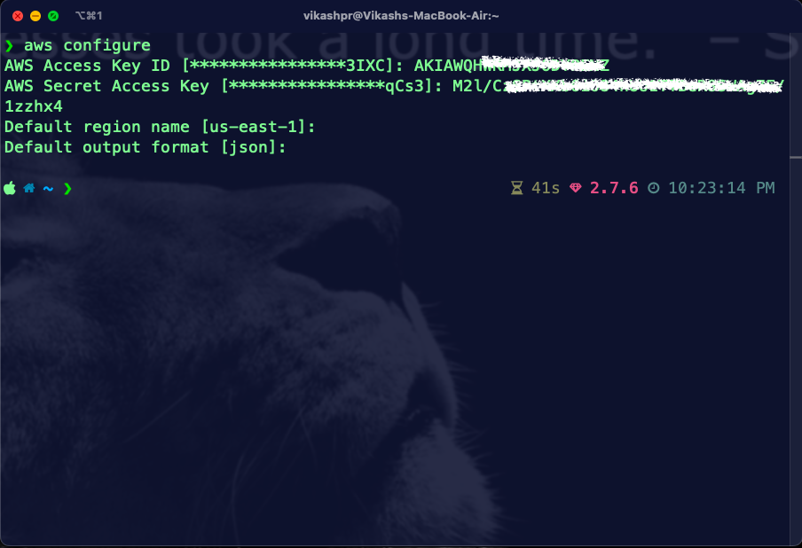

# Creation and Usage of Access Keys

## Prerequisites

- AWS account
- IAM user with admin access (Refer [Ex-1](../Ex-1/Ex-1.md))


## Procedure for Creating Access Keys

- Login to AWS account Link: https://aws.amazon.com/
- Go to IAM service
- Click on Users
- Select the user for which you want to create access keys

- Click on Security Credentials tab

- In the same page, scroll down to Access Keys section and click on Create Access Key

- In Access key best practices & alternatives page click on others and click next to proceed
- Provide description and click on Create Access Key

- Download the CSV file and store it in a secure location because this is the only time you will be able to see the secret access key


## Procedure for Using Access Keys using AWS CLI

- Download and install AWS CLI [Link](https://docs.aws.amazon.com/cli/latest/userguide/install-cliv2.html)
- Verify the installation

```bash
aws --version
```

``` bash 
which aws
```


- Configure AWS CLI using the access key and secret access key

```bash
aws configure
```

- Provide the access key and secret access key
- Provide the region and output format
- Now you can use AWS CLI to perform any operation

- To verify the configuration

```bash
aws sts get-caller-identity
```


- Success! You have created and used access keys using AWS CLI