# To Create an EC2 Instance and Perform S3 Lifecycle Configuration

## Prerequisites

- AWS CLI
- AWS Account
- IAM User with Administrator Access


## Steps to Perform

### Step 1: Create an EC2 Instance

1. Login to your AWS account and go to the EC2 Dashboard. [Link](https://console.aws.amazon.com/ec2/v2/home?region=us-east-1#Home:)
2. Click on **Launch Instance**.
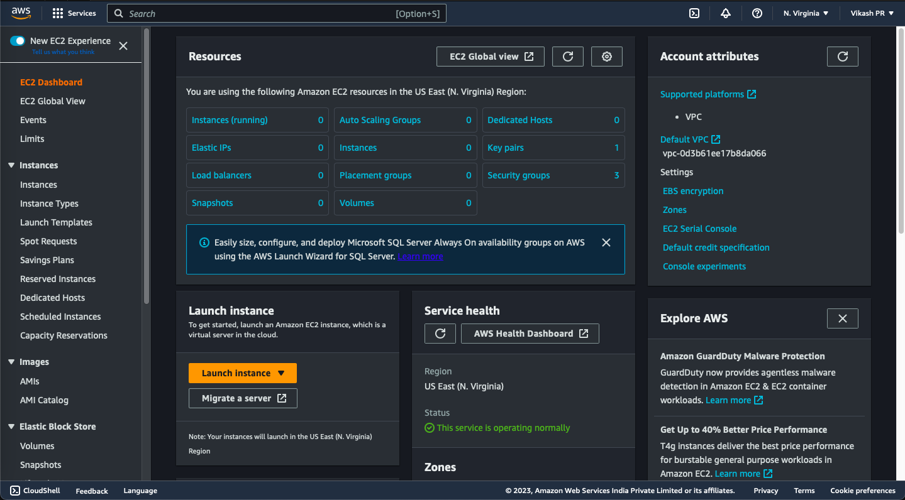
3. Give a name to your instance.
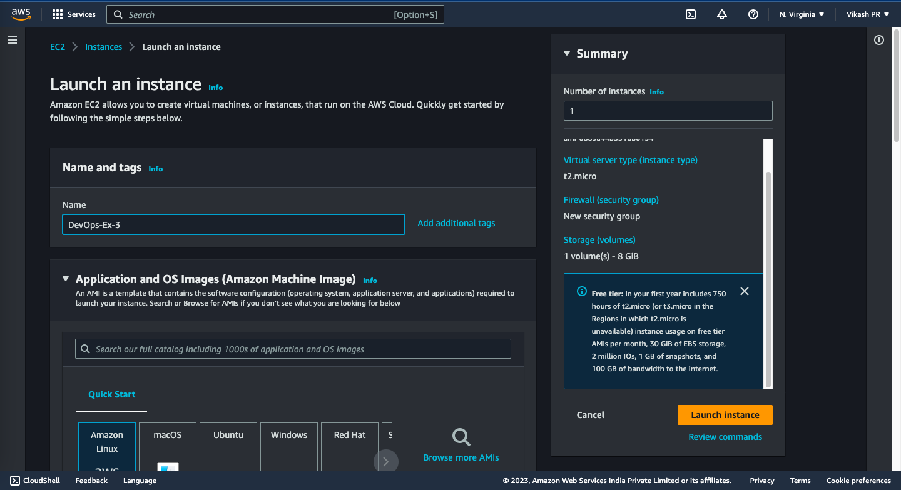
4. Select an Amazon Machine Image (AMI). For this experiment, we will use the **Amazon Linux 2 AMI (HVM), SSD Volume Type**.
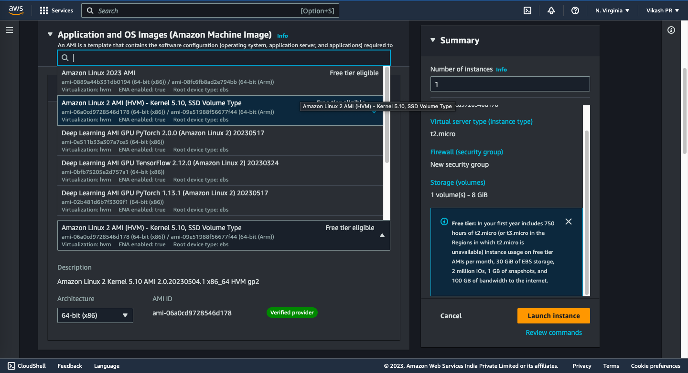
5. Select an instance type. For this experiment, we will use the **t2.micro** instance type.
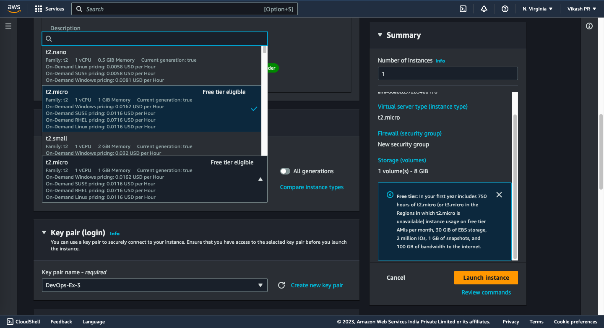
6. Create a new key pair and download it. This will be used to connect to the instance.
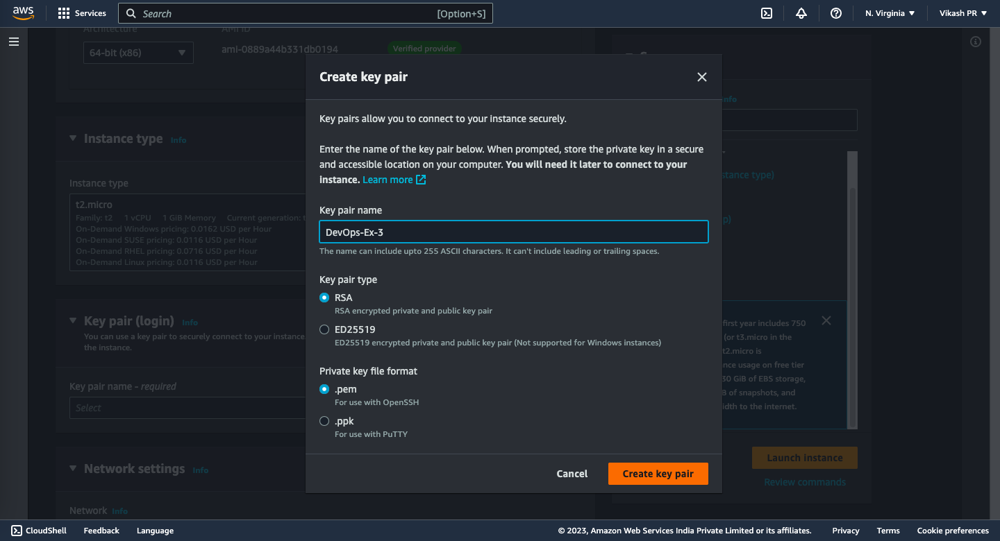
7. Click on **Launch Instance**.
8. Success! Your instance is now launched.
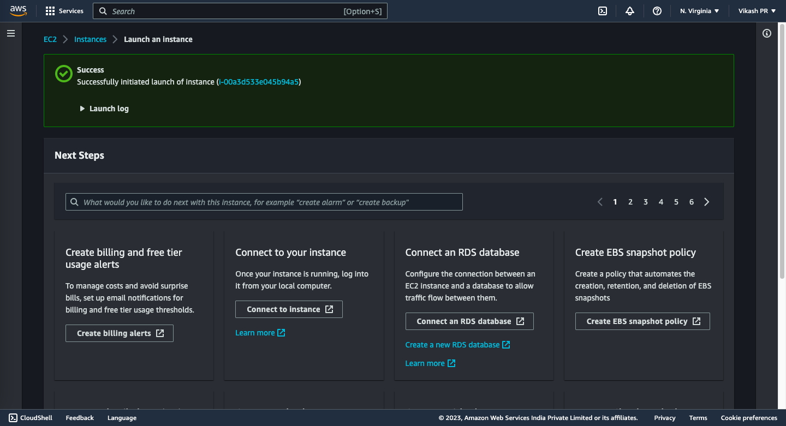
9. Click on **View Instances** to view your instance.


### Step 2: Connect to the Instance

1. Open your terminal and go to the directory where you downloaded the key pair.
2. Change the permissions of the key pair file using the following command:
```bash
chmod 400 <key-pair-name>.pem
```
3. Connect to the instance using the following command:
```bash
ssh -i <key-pair-name>.pem ec2-user@<public-ip-address>
```
4. You are now connected to the instance.


### Step 3: Create a Bucket

1. Go to the S3 Dashboard. [Link](https://s3.console.aws.amazon.com/s3/home?region=us-east-1#)
2. Click on **Create Bucket**.
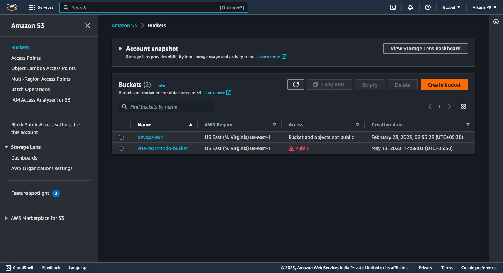
3. Give a name to your bucket.
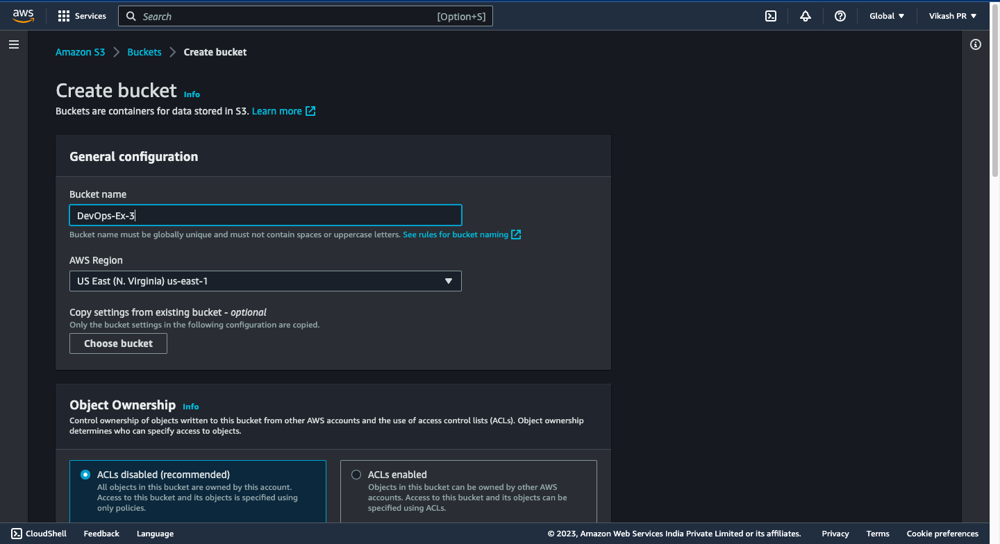
4. Select a region. For this experiment, we will use the **US East (N. Virginia)** region.
5. Scroll down and Click on **Create bucket**.
6. Success! Your bucket is now created.
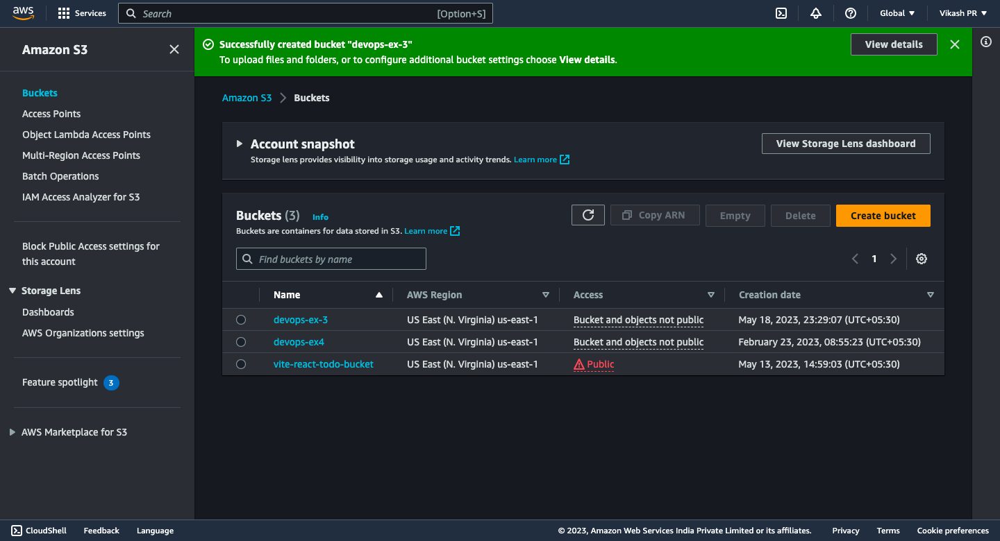


### Step 4: Upload a File to the Bucket

1. Click on the bucket you just created.
2. Click on **Upload**.
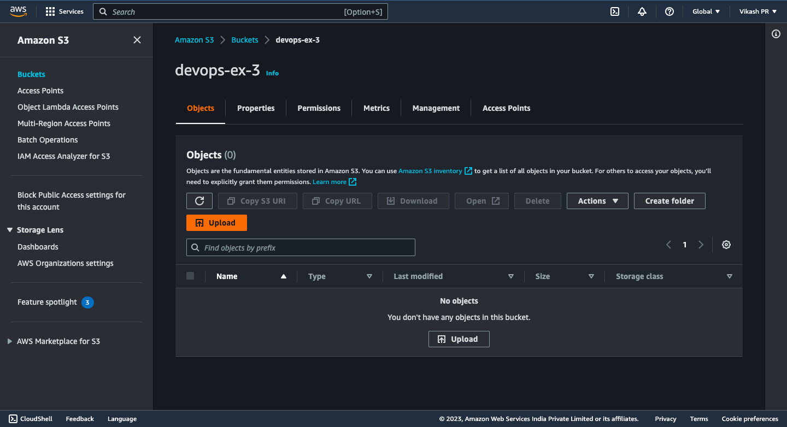
3. Click on **Add files**.
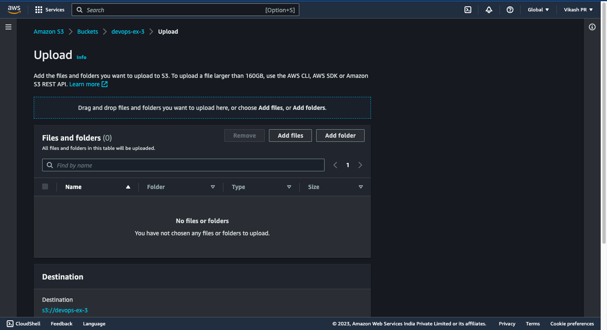
4. Select a file and click on **Next**.
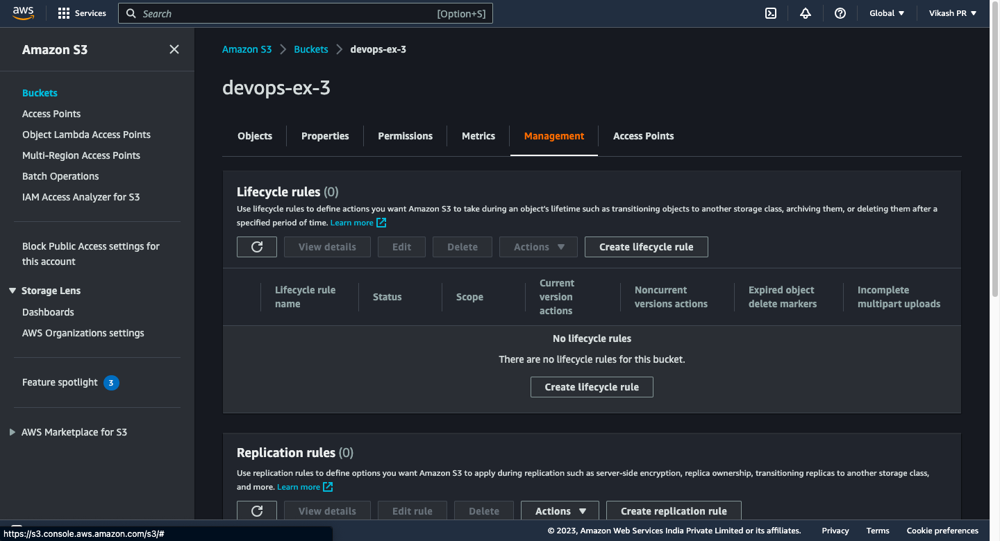
5. After selecting the file, click on **Upload**.


### Step 5: Create a Lifecycle Policy

1. Go to the S3 Dashboard. [Link](https://s3.console.aws.amazon.com/s3/home?region=us-east-1#)
2. Click on the bucket you just created.
3. Click on **Management**.
4. Click on **Add lifecycle rule**.
5. Give a name to your lifecycle rule. For this experiment, we will use the name **DevOps Ex-3**.
6. Enter the prefix of the object. For this experiment, we will use the prefix **Ex-3**.
7. Add object tags. For this experiment, we will use the tag **Ex-3**.
8. Select the lifecycle rule action. For this experiment, we will use the action **Transition to Standard-IA storage class after 30 days**.
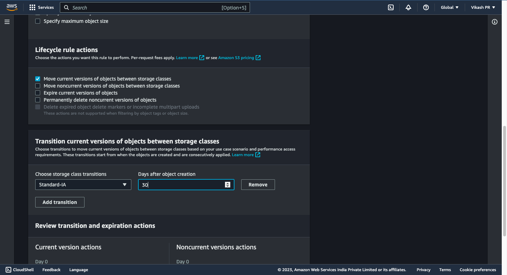
9. Click on **Create Rules**.
10. Success! Your lifecycle rule is now created.
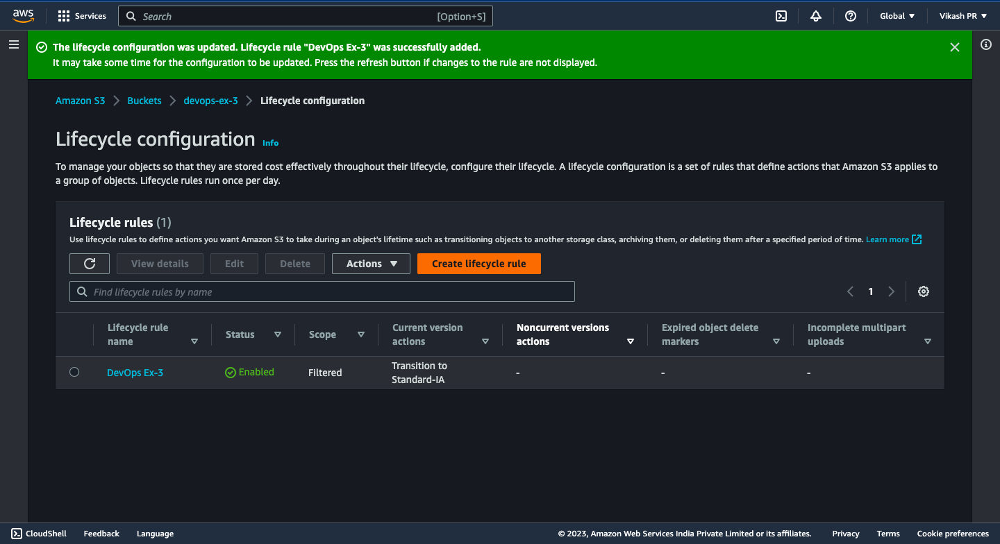

<!-- Stopping the Ex2 instance to avoid burning all your money lol -->

### Step 6: Stop the Instance

1. Go to the EC2 Dashboard. [Link](https://console.aws.amazon.com/ec2/v2/home?region=us-east-1#Home:)
2. Click on **Instances**.
3. Select the instance you just created.
4. Click on **Actions**.
5. Click on **Instance State**.
6. Click on **Stop**. To avoid burning all your daddy's money  


