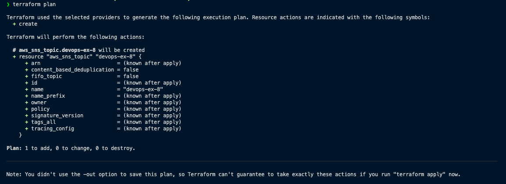
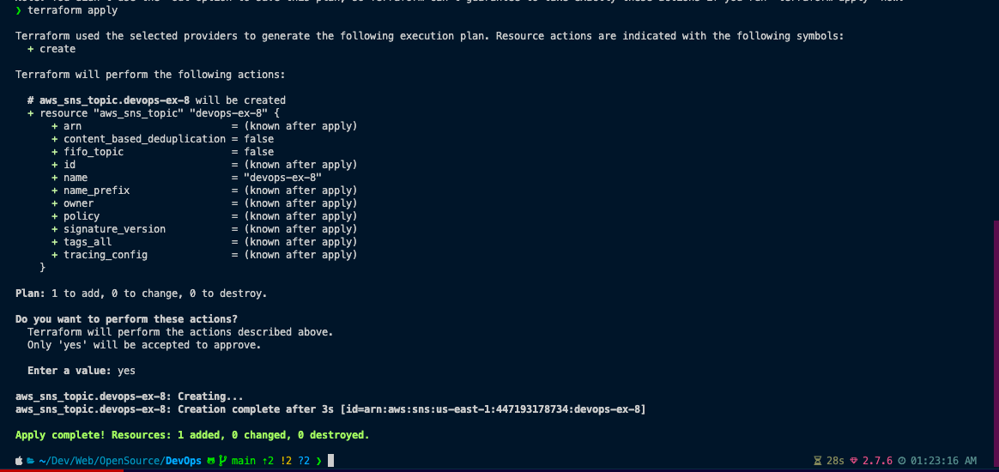
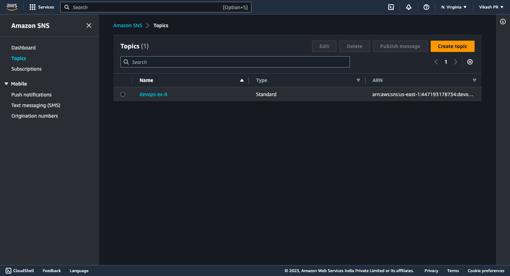
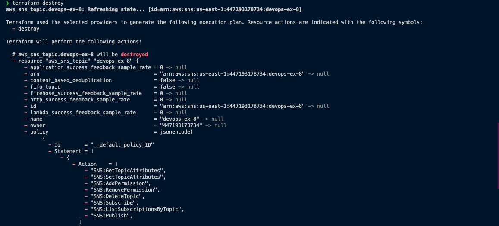
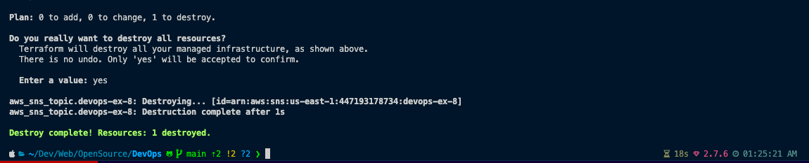

# Working with Terraform Providers (AWS Provider: Creating SNS Topic)

## Prerequisites

- AWS account
- Terraform installed
- AWS CLI installed
- AWS CLI configured with your credentials

## Procedure

1. Create a directory for your project and change into it.
2. Create a file named `main.tf` and add the following code to it:

``` hcl
provider "aws" {
  region = "us-east-1"
}

resource "aws_sns_topic" "devops-ex-8" {
  name = "devops-ex-8"
}
```

3. Run `terraform init` to initialize the directory.

4. Run `terraform plan` to see what Terraform will do.

5. Run `terraform apply` to create the resources.


6. Run `terraform destroy` to destroy the resources.



7. Success! You have created an SNS topic using Terraform.

