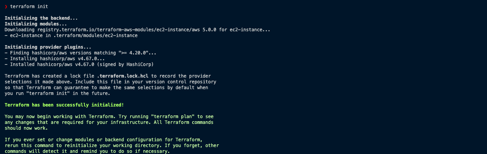
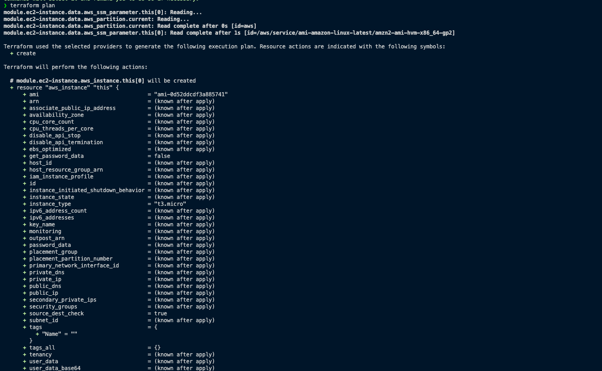
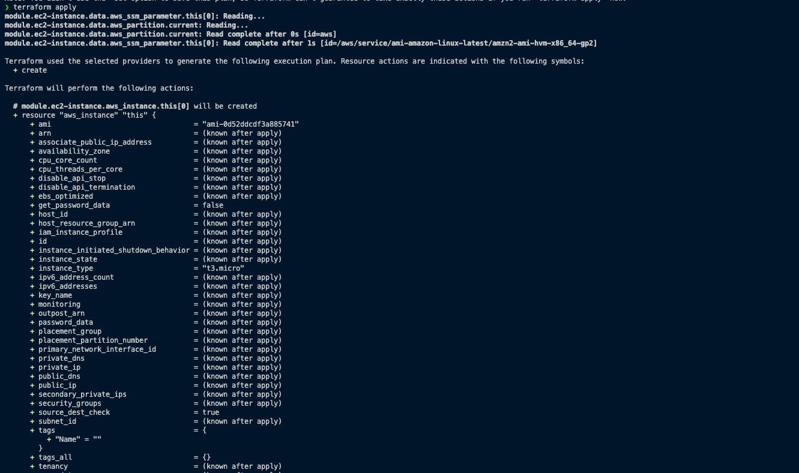
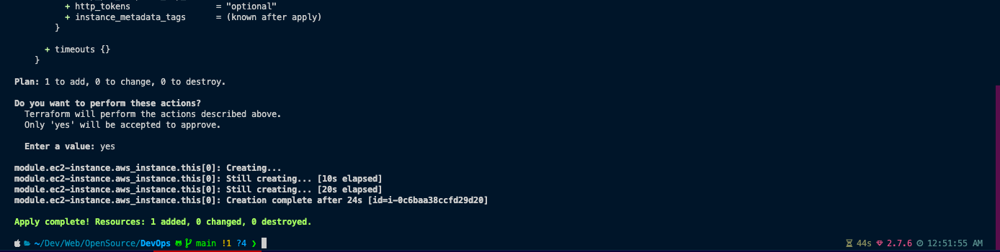
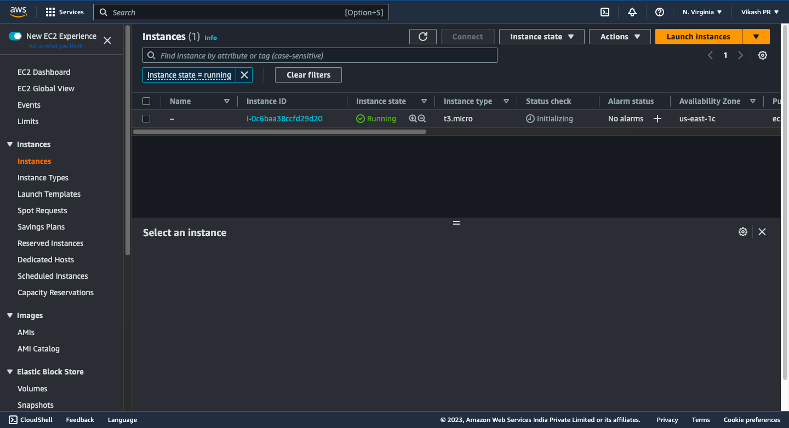
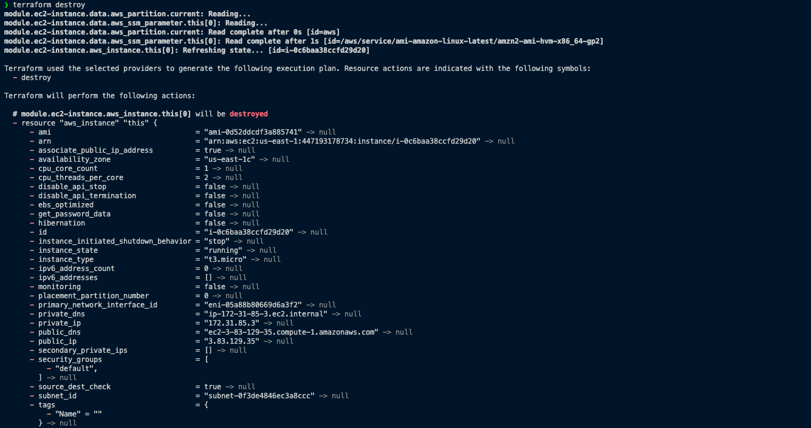
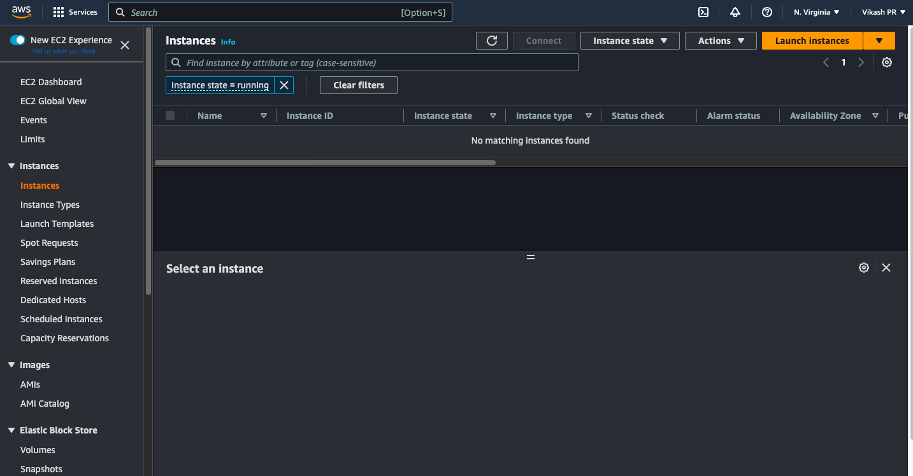

# Creating aws EC2 instance using terraform

## Prerequisites

- AWS account
- Terraform installed
- AWS CLI installed
- AWS CLI configured with your credentials


## Procedure using terraform EC2 module (ez way)

1. Create a directory for your project and change into it.
2. Create a file named `main.tf` and add the following code to it:

``` hcl
module "ec2-instance" {
  source  = "terraform-aws-modules/ec2-instance/aws"
  version = "5.0.0"
}
```

3. Run `terraform init` to initialize the directory.

4. Run `terraform plan` to see what Terraform will do.

5. Run `terraform apply` to create the resources.



6. Run `terraform destroy` to destroy the resources.




## Procedure using terraform aws provider

1. Create a directory for your project and change into it.
2. Create a file named `main.tf` and add the following code to it:

``` hcl
provider "aws" {
  region = "us-east-1"
}

resource "aws_instance" "devops-ex-7" {
  ami           = "ami-0c55b159cbfafe1f0"
  instance_type = "t2.micro"
}
```
3. Run `terraform init` to initialize the directory.
4. Run `terraform plan` to see what Terraform will do.
5. Run `terraform apply` to create the resources.
6. Run `terraform destroy` to destroy the resources.
